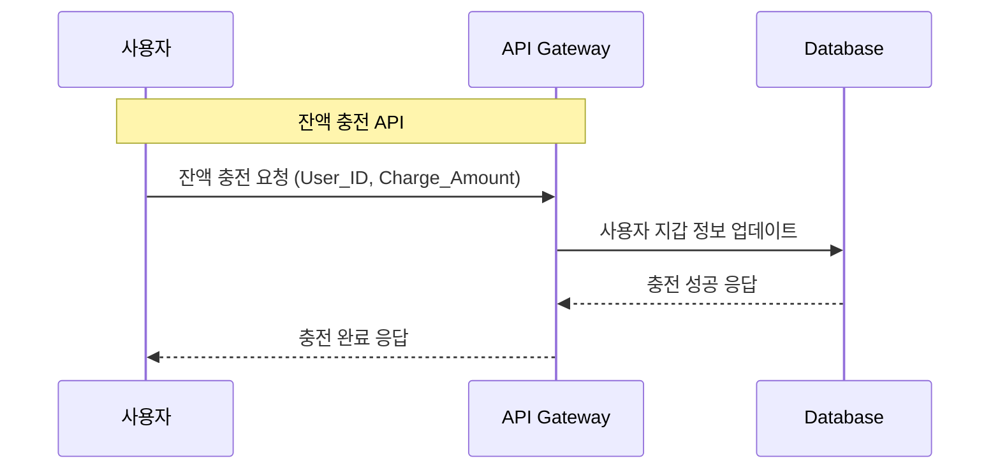
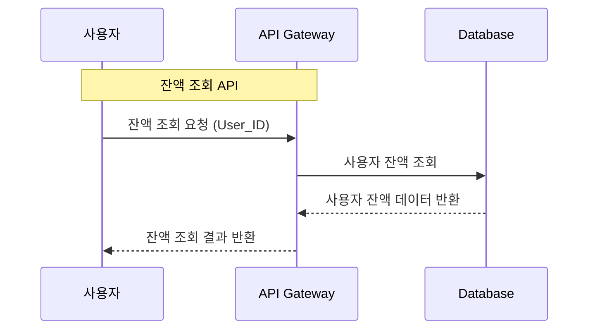
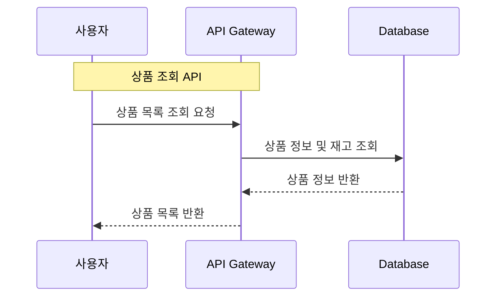
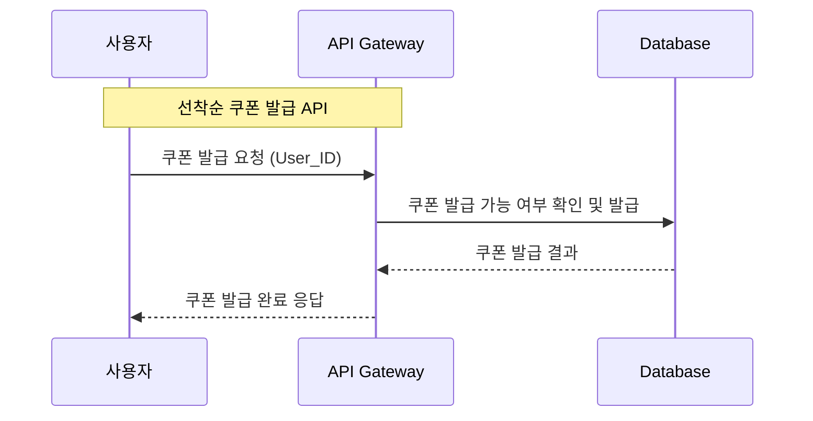
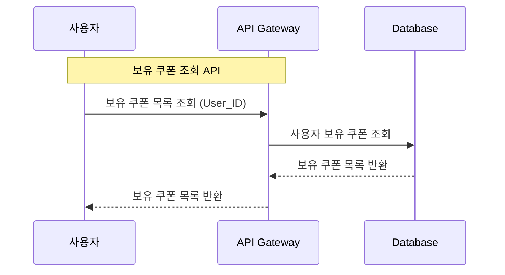
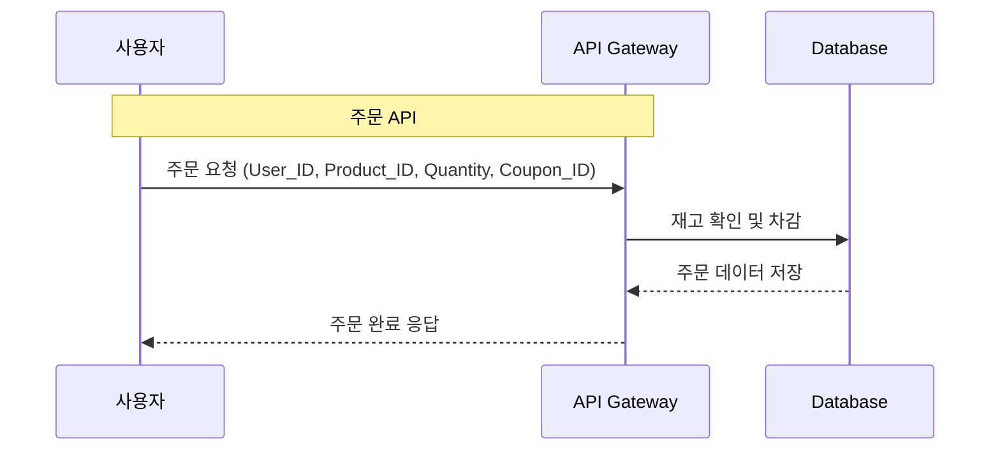
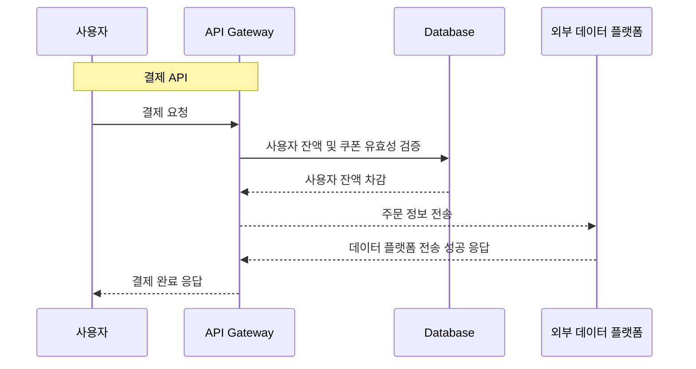
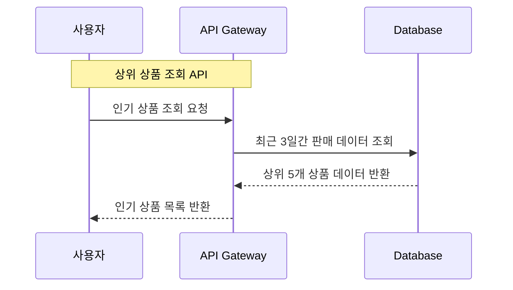

```mermaid
sequenceDiagram
    participant User as 사용자
    participant API as API Gateway
    participant DB as Database

    Note over User, API: 잔액 충전 API
    User->>API: 잔액 충전 요청 (User_ID, Charge_Amount)
    API->>DB: 사용자 지갑 정보 업데이트
    DB-->>API: 충전 성공 응답
    API-->>User: 충전 완료 응답
```

```mermaid
sequenceDiagram
    participant User as 사용자
    participant API as API Gateway
    participant DB as Database

    Note over User, API: 잔액 조회 API
    User->>API: 잔액 조회 요청 (User_ID)
    API->>DB: 사용자 잔액 조회
    DB-->>API: 사용자 잔액 데이터 반환
    API-->>User: 잔액 조회 결과 반환
```

```mermaid
sequenceDiagram
    participant User as 사용자
    participant API as API Gateway
    participant DB as Database

    Note over User, API: 상품 조회 API
    User->>API: 상품 목록 조회 요청
    API->>DB: 상품 정보 및 재고 조회
    DB-->>API: 상품 정보 반환
    API-->>User: 상품 목록 반환
```

```mermaid
sequenceDiagram
    participant User as 사용자
    participant API as API Gateway
    participant DB as Database

    Note over User, API: 선착순 쿠폰 발급 API
    User->>API: 쿠폰 발급 요청 (User_ID)
    API->>DB: 쿠폰 발급 가능 여부 확인 및 발급
    DB-->>API: 쿠폰 발급 결과
    API-->>User: 쿠폰 발급 완료 응답
```

```mermaid
sequenceDiagram
    participant User as 사용자
    participant API as API Gateway
    participant DB as Database

    Note over User, API: 보유 쿠폰 조회 API
    User->>API: 보유 쿠폰 목록 조회 (User_ID)
    API->>DB: 사용자 보유 쿠폰 조회
    DB-->>API: 보유 쿠폰 목록 반환
    API-->>User: 보유 쿠폰 목록 반환
```

```mermaid
sequenceDiagram
    participant User as 사용자
    participant API as API Gateway
    participant DB as Database

    Note over User, API: 주문 API
    User->>API: 주문 요청 (User_ID, Product_ID, Quantity, Coupon_ID)
    API->>DB: 재고 확인 및 차감
    DB-->>API: 주문 데이터 저장
    API-->>User: 주문 완료 응답
```

```mermaid
sequenceDiagram
    participant User as 사용자
    participant API as API Gateway
    participant DB as Database
    participant Ext as 외부 데이터 플랫폼

    Note over User, API: 결제 API
    User->>API: 결제 요청
    API->>DB: 사용자 잔액 및 쿠폰 유효성 검증
    DB-->>API: 사용자 잔액 차감
    API-->>Ext: 주문 정보 전송
    Ext-->>API: 데이터 플랫폼 전송 성공 응답
    API-->>User: 결제 완료 응답
```

```mermaid
sequenceDiagram
    participant User as 사용자
    participant API as API Gateway
    participant DB as Database

    Note over User, API: 상위 상품 조회 API
    User->>API: 인기 상품 조회 요청
    API->>DB: 최근 3일간 판매 데이터 조회
    DB-->>API: 상위 5개 상품 데이터 반환
    API-->>User: 인기 상품 목록 반환
```
